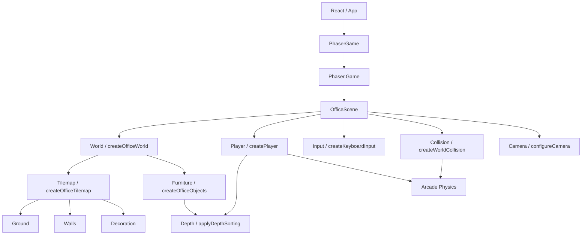

# Arquitectura

## Principios Actuales

La aplicación separa la presentación profesional de la simulación del mundo:

- React controla la interfaz del portafolio y su ciclo de renderizado.
- Phaser controla el Canvas, el World, el Player, el movimiento, la Camera,
  Collision, Tilemap y Physics.
- `PhaserGame` crea y destruye la instancia de `Phaser.Game` dentro del ciclo
  de vida de React.
- `OfficeScene` orquesta módulos con responsabilidades reales, sin contener
  la implementación completa de cada sistema.
- La composición visual utiliza una perspectiva top-down 3/4, según `DEC-007`.
- No existe backend ni comunicación de runtime con `VegaSystem`.

## Diagrama Real Implementado

```text
React / App
    |
    v
PhaserGame
    |
    v
Phaser.Game
    |
    v
OfficeScene
    |------------------|------------------|------------------|------------------|
    v                  v                  v                  v                  v
World                Player             Input              Collision           Camera
createOfficeWorld    createPlayer       createKeyboardInput configureWorldBounds configureCamera
    |                playerMovement     WASD + Arrow Keys  StaticGroup          follow + bounds
    |--------------------|
    v                    v
Tilemap              Furniture
Ground               createOfficeObjects
Walls                Graphics + Depth
Decoration

Depth
    |
    v
applyDepthSorting
```

El flujo real de inicialización es:

```text
main.tsx
  -> App.tsx
      -> PhaserGame.tsx
          -> createGameConfig(parent)
              -> new Phaser.Game(...)
                  -> OfficeScene.create()
                      -> createOfficeWorld()
                          -> Tilemap + Furniture
                      -> Player + Input + Collision + Camera
```

## Diagrama Mermaid



## Viewport, World Y Tile Size

El viewport lógico de Phaser es `960 x 540`, definido por `GAME_SIZE`. El
World provisional ocupa `1792 x 960`, comienza en `(48, 48)` y está definido
por `WORLD_BOUNDS` en `worldConfig.ts`.

`TILE_SIZE` está centralizado en `worldConfig.ts` con un valor inicial de
`32 x 32 px`. El mapa provisional utiliza `56 x 30` tiles, por lo que sus
dimensiones coinciden con el World. El tamaño puede revisarse cuando exista el
pixel art definitivo.

`Phaser.Scale.FIT` adapta el Canvas al espacio responsive que React reserva en
`.game-frame`. La resolución física del dispositivo no se utiliza como tamaño
fijo del World.

## Responsabilidades De Los Módulos

### `src/game/PhaserGame.tsx`

Es el adaptador entre React y Phaser. Mantiene una referencia al elemento DOM
que aloja el Canvas, crea `Phaser.Game` una vez al montar el componente y
destruye la instancia al desmontarlo.

### `src/game/config.ts`

Define `GAME_SIZE`, `RENDER_CONFIG` y `createGameConfig`. Configura
`Phaser.AUTO`, `Phaser.Scale.FIT`, centrado automático, `Arcade Physics` sin
gravedad y el registro de `OfficeScene`. `RENDER_CONFIG` activa `pixelArt`,
desactiva `antialias` y activa `roundPixels`.

### `src/game/scenes/OfficeScene.ts`

Es la única escena actual y actúa como orquestador. Construye el World, crea
el Player, conecta Input, Collision y Camera, y delega el movimiento. No carga
assets, calcula depth directamente, administra Tilemap internamente ni
implementa `InteractionSystem`.

### `src/game/world/worldConfig.ts`

Centraliza `TILE_SIZE`, `TILEMAP_SIZE` y `WORLD_BOUNDS`. Es la única fuente de
las dimensiones lógicas que comparten Tilemap, Camera y Collision.

### `src/game/world/officeLayout.ts`

Mantiene las definiciones geométricas de `OFFICE_OBSTACLES`. No dibuja ni crea
cuerpos físicos; sus datos son consumidos por Furniture y Collision para
mantener separadas esas responsabilidades.

### `src/game/world/createOfficeWorld.ts`

Compone el World visual llamando a `createOfficeTilemap` y
`createOfficeObjects`. No administra Input, Camera, Collision ni interacciones.

### `src/game/world/createOfficeTilemap.ts`

Genera un tileset provisional local y un `Tilemap` ortogonal con las capas
`Ground`, `Walls` y `Decoration`. `Ground` se rellena con el tile de suelo,
`Walls` muestra el borde del mapa y `Decoration` coloca algunos tiles
provisionales. Las capas son estáticas y no pasan por `Depth sorting` dinámico.

### `src/game/world/createOfficeObjects.ts`

Genera Furniture provisional con `Graphics`. Cada objeto conserva volumen
visible en su parte superior, frontal y lateral, y utiliza la base vertical
como referencia para su profundidad. La representación visual no contiene el
cuerpo de Collision.

### `src/game/entities/createPlayer.ts`

Genera la textura provisional en memoria y crea el
`Phaser.Physics.Arcade.Sprite`. Configura su cuerpo, límites del World, arrastre
y velocidad máxima. Su gráfico está encapsulado para que un `spritesheet` y
animaciones futuras no obliguen a cambiar Input o Player Movement.

### `src/game/entities/playerMovement.ts`

Define `PLAYER_SPEED` y `updatePlayerMovement`. Aplica velocidad en píxeles por
segundo y delega la profundidad en `applyDepthSorting`.

### `src/game/input/createKeyboardInput.ts`

Registra `WASD` y Arrow Keys, combina sus estados y normaliza el movimiento
diagonal. Phaser administra las teclas junto con la escena; no hay listeners
DOM manuales que limpiar.

### `src/game/camera/configureCamera.ts`

Define `CAMERA_CONFIG` y configura límites, zoom y seguimiento del Player. La
Camera redondea su seguimiento mediante `startFollow(..., true, ...)` para
evitar desplazamientos subpixel innecesarios.

### `src/game/collision/createWorldCollision.ts`

Configura los límites externos de `Arcade Physics`, crea un `StaticGroup` con
cinco obstáculos y registra la colisión entre ese grupo y el Player. No
calcula profundidad visual y no depende de las capas de Tilemap.

### `src/game/rendering/depthSorting.ts`

Expone `DEPTH_CONFIG` y `applyDepthSorting`. Los elementos dinámicos reciben
`dynamicBase + baseY`; Ground, Walls y Decoration mantienen depths estáticos.
Esto permite ordenar Player, NPCs futuros y Furniture sin dispersar llamadas a
`setDepth`.

## Capas Visuales

La composición real es:

```text
Ground       depth 0       TilemapLayer
Walls        depth 20      TilemapLayer
Decoration   depth 30      TilemapLayer
Furniture    1000 + baseY  Graphics dinámicos
Player       1000 + y      Arcade Sprite
```

Furniture y Player comparten la misma escala de profundidad. Un objeto se
considera apoyado en su `baseY`, que corresponde a su borde inferior. Por eso
el Player queda detrás cuando su `y` es menor que la base del objeto y delante
cuando se desplaza por debajo de ella.

La prueba provisional contiene muebles con colisión y profundidad. El Player
comienza debajo del mueble central, visible delante; al rodearlo y acercarse
desde arriba, su profundidad queda menor y se muestra detrás.

## Tilemap Y Compatibilidad Con Tiled

El Tilemap actual se genera desde una matriz vacía local y un tileset creado
con `Graphics`. No existe todavía un archivo JSON ni una carga desde red.

La estructura preparada para assets es:

```text
src/assets/
├── maps/.gitkeep
├── tilesets/.gitkeep
├── sprites/
│   ├── player/.gitkeep
│   └── objects/.gitkeep
├── ui/.gitkeep
└── placeholders/.gitkeep
```

Los mapas JSON exportados desde Tiled deberán ir en `src/assets/maps/` y los
tilesets en `src/assets/tilesets/`. En una futura escena de carga se podrá usar
`this.load.tilemapTiledJSON` y después `scene.make.tilemap({ key })`, sin
cambiar Input, Player Movement, Camera o Collision. Esa carga todavía no está
implementada.

## Collision Y Visual Depth

Estas responsabilidades permanecen separadas:

- Furniture y Tilemap definen la representación visual.
- `createWorldCollision` define los cuerpos físicos.
- `applyDepthSorting` define el orden de dibujado de los elementos dinámicos.

Un objeto futuro podrá tener las tres partes sin obligar a que una conozca la
implementación interna de las otras.

## React Y Phaser

React sigue siendo responsable de la UI, overlays, ventanas y contenido
profesional. Phaser sigue siendo responsable del World RPG, Player, Tilemap,
Input, Camera, Collision, Depth y Physics. No existe todavía comunicación de
estado entre `OfficeScene` y los paneles React.

## Planificado

La estructura actual permite añadir sprites definitivos, cargar mapas JSON de
Tiled, separar frentes y partes superiores de paredes, añadir animaciones del
Player y convertir Furniture en objetos interactivos. No existen todavía
`InteractionSystem`, indicadores, diálogos, inventario, NPCs ni conexión de
objetos con paneles React.
