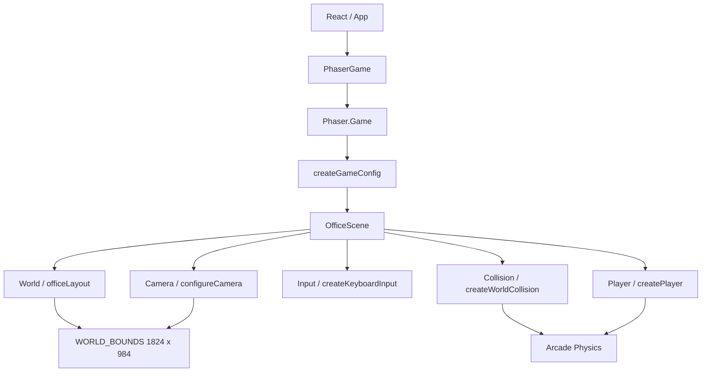

# Arquitectura

## Principios Actuales

La aplicación separa la presentación profesional de la simulación del mundo:

- React controla la interfaz del portafolio y su ciclo de renderizado.
- Phaser controla el canvas, el World, el Player, el movimiento, la Camera y
  la Physics.
- `PhaserGame` crea y destruye la instancia de `Phaser.Game` dentro del ciclo
  de vida de React.
- `OfficeScene` orquesta módulos especializados, pero no implementa todos los
  detalles de World, Input, Collision o Camera.
- No existe backend ni comunicación de runtime con `VegaSystem`.

## Diagrama Real Implementado

```text
React / App
    |
    v
PhaserGame
    |
    | crea Phaser.Game usando un elemento DOM como parent
    v
Phaser.Game
    |
    | registra y ejecuta OfficeScene
    v
OfficeScene
    |------------------|------------------|------------------|------------------|
    v                  v                  v                  v
World                Player             Input              Collision           Camera
officeLayout         createPlayer       createKeyboardInput configureWorldBounds configureCamera
Graphics             playerMovement     WASD + Arrow Keys  StaticGroup          follow + bounds
```

El flujo real de inicialización es:

```text
main.tsx
  -> App.tsx
      -> PhaserGame.tsx
          -> createGameConfig(parent)
              -> new Phaser.Game(...)
                  -> OfficeScene.create()
                      -> World / Player / Input / Collision / Camera
```

## Diagrama Mermaid



## Viewport Y World

El viewport lógico de Phaser es `960 x 540`, definido por `GAME_SIZE`. El
World provisional ocupa `1824 x 984` y está definido por `WORLD_BOUNDS` en
`officeLayout.ts`. Esta diferencia permite comprobar el seguimiento de la
Camera en lugar de mostrar todo el mundo a la vez.

`Phaser.Scale.FIT` adapta el canvas al espacio responsive que React reserva en
`.game-frame`. La resolución física del dispositivo no se utiliza como tamaño
fijo del mundo.

## Responsabilidades De Los Módulos

### `src/game/PhaserGame.tsx`

Es el adaptador entre React y Phaser. Mantiene una referencia al elemento DOM
que aloja el canvas, crea `Phaser.Game` una vez al montar el componente y
destruye la instancia al desmontarlo. No contiene lógica del mundo, controles
ni presentación de datos profesionales.

### `src/game/config.ts`

Define `GAME_SIZE` y construye el objeto de configuración mediante
`createGameConfig`. Configura `Phaser.AUTO`, `Phaser.Scale.FIT`, centrado
automático, `Arcade Physics` sin gravedad y el registro de `OfficeScene`.
También habilita la visualización de cuerpos de Physics únicamente cuando
`import.meta.env.DEV` es verdadero.

### `src/game/scenes/OfficeScene.ts`

Es la única escena actual y actúa como orquestador. Construye el World,
configura sus límites, crea el Player, registra los sistemas de Input y
Collision, configura la Camera y delega el movimiento al módulo de Player.
No implementa objetos interactivos, transiciones, ventanas React ni un
`InteractionSystem`.

### `src/game/world/officeLayout.ts`

Define `WORLD_BOUNDS`, el tipo `WorldBounds`, los obstáculos provisionales y
el dibujo procedural de la oficina con `Graphics`. Es la definición visual y
geométrica del World actual. Los obstáculos visuales se mantienen separados
de sus cuerpos físicos, que son creados por `createWorldCollision`.

### `src/game/entities/createPlayer.ts`

Genera una textura provisional en memoria con `Graphics` si todavía no existe,
crea el `Phaser.Physics.Arcade.Sprite` y configura su cuerpo, límites del
mundo, arrastre y velocidad máxima. La textura está encapsulada aquí para que
un Sprite con animaciones pueda sustituirla sin mover la orquestación de la
escena.

### `src/game/entities/playerMovement.ts`

Define `PLAYER_SPEED` y `updatePlayerMovement`. Aplica velocidad en píxeles por
segundo al Player y actualiza su profundidad visual. No lee el teclado ni
conoce la escena.

### `src/game/input/createKeyboardInput.ts`

Registra `WASD` y Arrow Keys con el plugin de teclado de Phaser y expone
`readMovementDirection`, que combina ambas entradas y normaliza el movimiento
diagonal. Phaser administra el ciclo de vida de estas teclas junto con la
escena; no hay listeners DOM manuales que limpiar.

### `src/game/camera/configureCamera.ts`

Define `CAMERA_CONFIG` y `configureCamera`. La Camera principal usa los
límites del World, sigue al Player con `lerpX` y `lerpY` de `0.12` y mantiene
el zoom en `1`. Los parámetros se pueden ajustar en este módulo sin repartir
configuración por `OfficeScene`.

### `src/game/collision/createWorldCollision.ts`

Configura los límites externos de `Arcade Physics`, crea un `StaticGroup` con
obstáculos provisionales y registra la colisión entre ese grupo y el Player.
Los cuerpos de los obstáculos son invisibles en la escena y solo se muestran
cuando el debug de Physics está activo en desarrollo.

### `src/game/index.ts`

Expone `PhaserGame` como punto de entrada público del módulo `src/game`.

### `src/App.tsx`

Renderiza la interfaz React provisional y coloca `PhaserGame` dentro del marco
visual del mundo. Los paneles actuales no reciben estado desde `OfficeScene`.

## Player

El Player recibe un `Phaser.Physics.Arcade.Sprite` provisional con un cuerpo
menor que su textura para mejorar el contacto con el suelo. Cada actualización
lee la dirección ya normalizada desde Input y la entrega a
`updatePlayerMovement`. Una dirección vacía aplica velocidad cero, por lo que
el personaje se detiene inmediatamente al soltar las teclas.

## World Bounds Y Collision

`configureWorldBounds` establece `WORLD_BOUNDS` como límite invisible de
`Arcade Physics`. `createPlayer` activa `setCollideWorldBounds(true)`, así que
el Player no puede abandonar el World.

Además, `createWorldCollision` crea cinco obstáculos estáticos provisionales
alineados con elementos visuales del layout. Estos cuerpos demuestran la
colisión con muebles simples sin convertir todavía el sistema en un catálogo
de objetos del portafolio.

## Camera

La Camera principal se configura después de crear el Player. `setBounds`
impide que el viewport salga del World y `startFollow` mantiene al Player como
foco principal. Los valores de `lerp` evitan un seguimiento brusco sin
introducir una lógica de actualización adicional en `OfficeScene`.

## React Y Phaser

React sigue siendo responsable de la UI, overlays, ventanas y contenido
profesional. Phaser sigue siendo responsable del World RPG, Player, Input,
Camera, Collision y Physics. En esta implementación no hay comunicación de
estado entre `OfficeScene` y los paneles React.

## Planificado

La estructura actual permite añadir sprites animados, más obstáculos, objetos
interactivos, zonas de interacción y escenas adicionales. No existen todavía
`InteractionSystem`, indicadores, diálogos, inventario, NPCs ni conexión de
objetos con paneles React.
