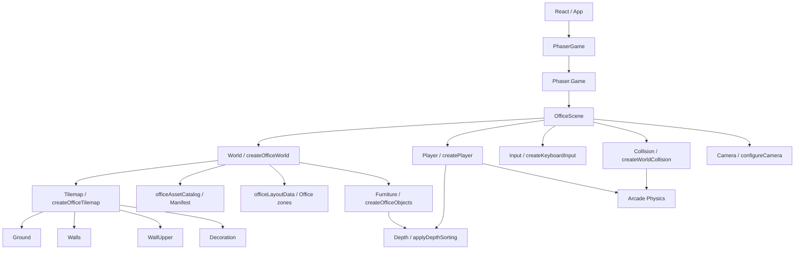

# Arquitectura

## Principios Actuales

La aplicación separa la presentación profesional de la simulación del mundo:

- React controla la interfaz del portafolio y su ciclo de renderizado.
- Phaser controla el Canvas, el World, el Player, el movimiento, la Camera,
  Collision, Tilemap y Physics.
- `PhaserGame` crea y destruye la instancia de `Phaser.Game` dentro del ciclo
  de vida de React.
- `OfficeScene` orquesta módulos con responsabilidades reales, sin contener
  la implementación completa de cada sistema.
- `OfficeWorld` se construye desde un catálogo de assets y una definición de
  layout data-driven.
- La composición visual utiliza una perspectiva top-down 3/4, según `DEC-007`.
- No existe backend ni comunicación de runtime con `VegaSystem`.

## Diagrama Real Implementado

```text
React / App
    |
    v
PhaserGame
    |
    v
Phaser.Game
    |
    v
OfficeScene
    |------------------|------------------|------------------|------------------|
    v                  v                  v                  v                  v
World                Player             Input              Collision           Camera
createOfficeWorld    createPlayer       createKeyboardInput configureWorldBounds configureCamera
    |                playerMovement     WASD + Arrow Keys  OFFICE_OBJECTS       follow + bounds
    |--------------------------|
    v                          v
Tilemap                    OfficeObjects
Ground                     officeLayoutData
Walls                      Graphics + Depth
WallUpper                  Collision metadata
Decoration

Depth
    |
    v
applyDepthSorting
```

El flujo real de inicialización es:

```text
main.tsx
  -> App.tsx
      -> PhaserGame.tsx
          -> createGameConfig(parent)
              -> new Phaser.Game(...)
                  -> OfficeScene.create()
                      -> createOfficeWorld()
                          -> Tilemap + Furniture
                      -> Player + Input + Collision + Camera
```

## Diagrama Mermaid



## Viewport, World Y Tile Size

El viewport lógico de Phaser es `960 x 540`, definido por `GAME_SIZE`. El
World provisional ocupa `1792 x 960`, comienza en `(48, 48)` y está definido
por `WORLD_BOUNDS` en `worldConfig.ts`.

`TILE_SIZE` está centralizado en `worldConfig.ts` con un valor inicial de
`32 x 32 px`. El mapa provisional utiliza `56 x 30` tiles, por lo que sus
dimensiones coinciden con el World. El tamaño puede revisarse cuando exista el
pixel art definitivo.

`Phaser.Scale.FIT` adapta el Canvas al espacio responsive que React reserva en
`.game-frame`. La resolución física del dispositivo no se utiliza como tamaño
fijo del World.

## Responsabilidades De Los Módulos

### `src/game/PhaserGame.tsx`

Es el adaptador entre React y Phaser. Mantiene una referencia al elemento DOM
que aloja el Canvas, crea `Phaser.Game` una vez al montar el componente y
destruye la instancia al desmontarlo.

### `src/game/config.ts`

Define `GAME_SIZE`, `RENDER_CONFIG` y `createGameConfig`. Configura
`Phaser.AUTO`, `Phaser.Scale.FIT`, centrado automático, `Arcade Physics` sin
gravedad y el registro de `OfficeScene`. `RENDER_CONFIG` activa `pixelArt`,
desactiva `antialias` y activa `roundPixels`.

### `src/game/scenes/OfficeScene.ts`

Es la única escena actual y actúa como orquestador. Construye el World, crea
el Player, conecta Input, Collision y Camera, y delega el movimiento. No carga
assets, calcula depth directamente, administra Tilemap internamente ni
implementa `InteractionSystem`.

### `src/game/world/worldConfig.ts`

Centraliza `TILE_SIZE`, `TILEMAP_SIZE` y `WORLD_BOUNDS`. Es la única fuente de
las dimensiones lógicas que comparten Tilemap, Camera y Collision.

### `src/game/world/officeAssetCatalog.ts`

Define `OFFICE_TILE_KEYS`, `OFFICE_OBJECT_KEYS`, `OFFICE_TILE_INDEX`,
`OFFICE_PALETTE` y `OFFICE_ASSET_MANIFEST`. El manifest describe tipo, path
futuro, frame, Collision y Depth. No carga paths inexistentes.

### `src/game/world/officeLayoutData.ts`

Define `OFFICE_OBJECTS`, `OFFICE_ZONES` y los tipos de composición. Cada
objeto declara `id`, asset, categoría, zona, posición de apoyo, tamaño visual,
Collision y `depthMode`. `OfficeScene` no contiene coordenadas de Furniture.

### `src/game/world/officeLayout.ts`

Mantiene el punto de entrada histórico para los datos de oficina y reexporta
`OFFICE_OBJECTS` y `OFFICE_ZONES` desde `officeLayoutData`. No dibuja ni crea
cuerpos físicos.

### `src/game/world/createOfficeWorld.ts`

Compone el World visual llamando a `createOfficeTilemap` y
`createOfficeObjects`, y expone objetos dinámicos y upper por separado. No
administra Input, Camera, Collision ni interacciones.

### `src/game/world/createOfficeTilemap.ts`

Genera un tileset provisional local y un `Tilemap` ortogonal con las capas
`Ground`, `Walls`, `WallUpper` y `Decoration`. `Ground` se rellena con madera
y dos zonas de alfombra, `Walls` contiene la base visual del perímetro,
`WallUpper` muestra la parte superior elevada y `Decoration` coloca elementos
provisionales. Las capas son estáticas y no pasan por `Depth sorting` dinámico.

### `src/game/world/createOfficeObjects.ts`

Genera Furniture provisional con `Graphics` a partir de `OFFICE_OBJECTS` y
`OFFICE_ASSET_MANIFEST`. Incluye escritorios, PC, silla, librero, mesa de
proyectos, sofá, pizarrón, plantas, archivador y estante de logros. Cada objeto
conserva volumen visible y utiliza la base vertical como referencia para su
profundidad. La representación visual no contiene el cuerpo de Collision.

### `src/game/entities/createPlayer.ts`

Llama a `createPlayerVisual` y configura el Physics body del
`Phaser.Physics.Arcade.Sprite`, sus límites del World, arrastre y velocidad
máxima. El body mide `18 x 12 px` y comienza en el offset vertical `31`, por lo
que representa principalmente los pies y no toda la silueta.

### `src/game/entities/playerVisual.ts`

Define `Player`, `PLAYER_DIRECTIONS`, `PlayerAnimationState` y el tamaño visual
del personaje. Genera ocho texturas placeholder locales, crea los estados
`idle-down`, `idle-up`, `idle-left`, `idle-right`, `walk-down`, `walk-up`,
`walk-left` y `walk-right`, y mantiene la Shadow visual. El Player visible es
siempre un `Arcade Sprite`; `Graphics` solo se utiliza para generar las
texturas temporales.

La composición actual del Player es:

```text
Player
├── Sprite           Phaser.Physics.Arcade.Sprite
├── Direction        PlayerDirection
├── Animation        idle / walk por dirección
├── Movement         playerMovement
├── Physics Body     18 x 12 px en la zona inferior
├── Shadow           Ellipse visual sin Collision
└── Depth            applyDepthSorting con feetOffset
```

### `src/game/entities/playerMovement.ts`

Define `PLAYER_SPEED` y `updatePlayerMovement`. Aplica velocidad en píxeles por
segundo, conserva la última Direction cuando el Player se detiene y delega la
actualización de Animation, Shadow y Depth en `playerVisual`.

### `src/game/input/createKeyboardInput.ts`

Registra `WASD` y Arrow Keys, combina sus estados y normaliza el movimiento
diagonal. Phaser administra las teclas junto con la escena; no hay listeners
DOM manuales que limpiar.

### `src/game/camera/configureCamera.ts`

Define `CAMERA_CONFIG` y configura límites, zoom y seguimiento del Player. La
Camera redondea su seguimiento mediante `startFollow(..., true, ...)` para
evitar desplazamientos subpixel innecesarios.

### `src/game/collision/createWorldCollision.ts`

Configura los límites externos de `Arcade Physics`, crea un `StaticGroup` para
los objetos cuyo `collision` no es `null` y registra la colisión con el Player.
El body se coloca bajo `baseY` y usa el tamaño físico declarado, no el tamaño
visual completo. No calcula profundidad visual ni depende del dibujo de los
objetos.

### `src/game/rendering/depthSorting.ts`

Expone `DEPTH_CONFIG` y `applyDepthSorting`. Los elementos dinámicos reciben
`dynamicBase + baseY`; Ground, Walls y Decoration mantienen depths estáticos y
`WallUpper` usa `upperLayer`.
Esto permite ordenar Player, NPCs futuros y Furniture sin dispersar llamadas a
`setDepth`.

Player utiliza como base vertical `player.y + 22`, que corresponde a la zona de
los pies. Su Shadow utiliza esa misma base menos una unidad para permanecer
debajo visualmente.

## Capas Visuales

La composición real es:

```text
Ground       depth 0       TilemapLayer
Walls        depth 20      TilemapLayer
Decoration   depth 30      TilemapLayer
WallUpper    depth 1900    TilemapLayer
Furniture    1000 + baseY  Graphics dinámicos
Player       1000 + y + feetOffset  Arcade Sprite
```

En el Player, `y` se sustituye conceptualmente por `y + feetOffset` para que
el orden corresponda a la parte inferior del personaje y no al centro de su
Sprite.

Furniture y Player comparten la misma escala de profundidad. Un objeto se
considera apoyado en su `baseY`, que corresponde a su borde inferior. Por eso
el Player queda detrás cuando su `y` es menor que la base del objeto y delante
cuando se desplaza por debajo de ella.

La prueba provisional contiene muebles con colisión y profundidad. El Player
comienza debajo del mueble central, visible delante; al rodearlo y acercarse
desde arriba, su profundidad queda menor y se muestra detrás.

## Catálogo Y Composición

El catálogo distingue tiles (`floorWood`, `floorCarpet`, `wallBase`, `wallTop`,
`wallCorner`, `doorway`) y objetos (`desk`, `pc`, `chair`, `bookshelf`,
`projectTable`, `experienceDesk`, `sofa`, `coffeeTable`, `whiteboard`,
`plantSmall`, `plantLarge`, `lamp`, `trophyShelf`, `phone`, `filingCabinet`,
`door`, `rug`). La paleta provisional vive en `OFFICE_PALETTE` y no es una
decisión artística definitiva.

Las zonas semánticas actuales son `About`, `Projects`, `Skills`, `Experience`,
`Achievements` y `Contact`. Solo organizan la composición; no tienen triggers
ni `InteractionSystem`.

## Tilemap Y Compatibilidad Con Tiled

El Tilemap actual se genera desde una matriz vacía local y un tileset creado
con `Graphics`. No existe todavía un archivo JSON ni una carga desde red.

La estructura preparada para assets es:

```text
src/assets/
├── maps/.gitkeep
├── tilesets/office/.gitkeep
├── sprites/
│   ├── player/.gitkeep
│   └── objects/.gitkeep
├── ui/.gitkeep
└── placeholders/.gitkeep
```

Los mapas JSON exportados desde Tiled deberán ir en `src/assets/maps/` y los
tilesets en `src/assets/tilesets/`. En una futura escena de carga se podrá usar
`this.load.tilemapTiledJSON` y después `scene.make.tilemap({ key })`, sin
cambiar Input, Player Movement, Camera o Collision. Esa carga todavía no está
implementada.

## Collision Y Visual Depth

Estas responsabilidades permanecen separadas:

- Furniture y Tilemap definen la representación visual.
- `createWorldCollision` define los cuerpos físicos.
- `applyDepthSorting` define el orden de dibujado de los elementos dinámicos.
- `WallUpper` y los objetos `depthMode: 'upper'` pertenecen a una capa fija
  superior y no se mezclan con cuerpos físicos.

Un objeto futuro podrá tener las tres partes sin obligar a que una conozca la
implementación interna de las otras.

## Reemplazo De Placeholders

Los paths del manifest apuntan a futuros archivos en
`src/assets/tilesets/office/` y `src/assets/sprites/objects/`. Cuando exista
pixel art definitivo, se reemplaza la generación procedural por carga de esos
assets y se conserva el contrato de asset key, tamaño, baseY, Collision y
Depth. Los mapas Tiled JSON seguirán el mismo contrato.

## React Y Phaser

React sigue siendo responsable de la UI, overlays, ventanas y contenido
profesional. Phaser sigue siendo responsable del World RPG, Player, Tilemap,
Input, Camera, Collision, Depth y Physics. No existe todavía comunicación de
estado entre `OfficeScene` y los paneles React.

## Planificado

La estructura actual permite añadir sprites definitivos, cargar mapas JSON de
Tiled, separar frentes y partes superiores de paredes, añadir animaciones del
Player y convertir Furniture en objetos interactivos. No existen todavía
`InteractionSystem`, indicadores, diálogos, inventario, NPCs ni conexión de
objetos con paneles React.
