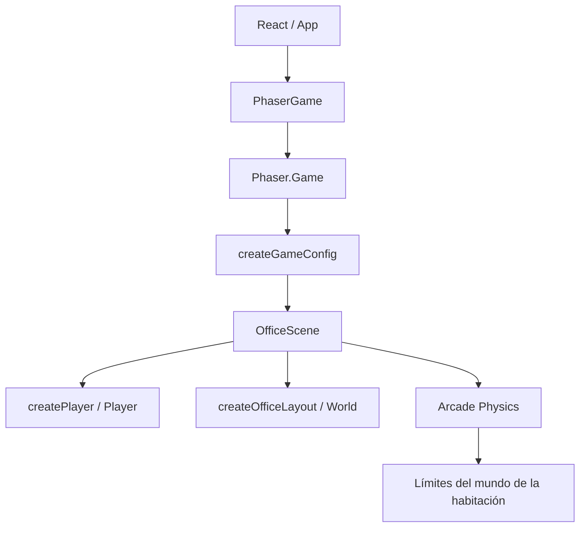

# Arquitectura

## Principios Actuales

La aplicación separa la presentación profesional de la simulación del mundo:

- React controla la interfaz del portafolio y su ciclo de renderizado.
- Phaser controla el canvas, la escena, el personaje, el movimiento y la
  física.
- La integración ocurre mediante un elemento DOM que React entrega como
  `parent` a `Phaser.Game`.
- No existe backend ni comunicación con `VegaSystem`.

## Diagrama Real Implementado

```text
React / App
    |
    v
PhaserGame
    |
    | crea Phaser.Game usando un elemento DOM como parent
    v
Phaser
    |
    | registra y ejecuta la escena configurada
    v
OfficeScene
    |------------------|------------------|
    v                  v                  v
Player              World              Physics
createPlayer        officeLayout       Arcade Physics
                    Graphics           world bounds
```

El flujo real de inicialización es:

```text
main.tsx
  -> App.tsx
      -> PhaserGame.tsx
          -> createGameConfig(parent)
              -> new Phaser.Game(...)
                  -> OfficeScene.create()
```

## Diagrama Mermaid



## Responsabilidades De Los Módulos

### `src/game/PhaserGame.tsx`

Es el adaptador entre React y Phaser. Mantiene una referencia al elemento DOM
que alojará el canvas, crea `Phaser.Game` una vez al montar el componente y
destruye la instancia al desmontarlo. No contiene lógica de escenas,
movimiento ni presentación de datos profesionales.

### `src/game/config.ts`

Define `GAME_SIZE` y construye el objeto de configuración de Phaser mediante
`createGameConfig`. Actualmente configura `Phaser.AUTO`, el tamaño lógico,
`Phaser.Scale.FIT`, centrado automático, `Arcade Physics` sin gravedad y el
registro de `OfficeScene`.

### `src/game/scenes/OfficeScene.ts`

Es la única escena actual. Construye el layout, configura los límites del
mundo, crea el `Player`, registra las teclas `WASD` y las flechas, calcula la
velocidad y actualiza la profundidad visual del personaje. No implementa
interacciones, transiciones, cámara personalizada ni comunicación directa con
React.

### `src/game/world/officeLayout.ts`

Define `ROOM_BOUNDS` y dibuja la oficina provisional con `Graphics`. También
dibuja elementos decorativos y textos de identificación de la sala. Los
elementos visuales definidos en `OFFICE_PROPS` no tienen cuerpos físicos ni
bloquean actualmente al personaje.

### `src/game/entities/createPlayer.ts`

Genera una textura provisional en memoria con `Graphics` si todavía no existe,
crea el `Phaser.Physics.Arcade.Sprite`, configura su profundidad, límites del
mundo, arrastre, velocidad máxima y el tamaño del cuerpo físico.

### `src/game/index.ts`

Expone `PhaserGame` como punto de entrada del módulo `src/game`.

### `src/App.tsx`

Renderiza la interfaz React provisional del portafolio y coloca `PhaserGame`
dentro del marco visual del mundo. Los paneles actuales son contenido
provisional de React; no reciben estado desde `OfficeScene`.

## Física Y Colisiones

`OfficeScene.create()` establece los límites del mundo con `ROOM_BOUNDS`. El
`Player` activa `setCollideWorldBounds(true)`, de modo que `Arcade Physics`
detiene el cuerpo al alcanzar los bordes. La oficina muestra un borde visual
correspondiente, pero no existe todavía una colección de paredes estáticas ni
colisiones con muebles.

## Planificado

La arquitectura podrá ampliarse con sprites, objetos interactivos, zonas de
interacción, más escenas y comunicación controlada entre Phaser y la interfaz
React. Esas piezas no existen todavía y no deben tratarse como módulos
actuales.
